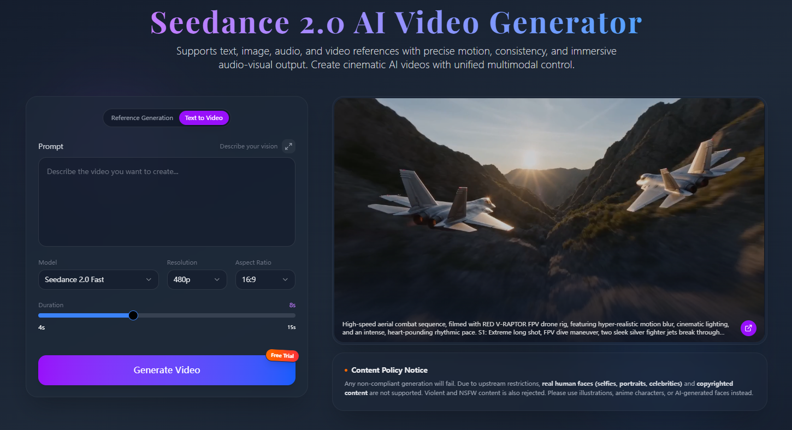

# Seedance 2.0 Mini AI Video Generator




## Overview

[Seedance 2.0 Mini AI Video Generator](https://www.jxp.com/seedance/seedance-2-mini) helps creators turn lightweight prompts and visual ideas into faster cinematic video drafts.

Seedance 2.0 Mini AI Video Generator is built for quick concept testing, short scene iteration, and faster creative review when teams want presentable motion results without a heavy production setup.

## Key Features

- Fast prompt-to-video iteration for short creative cycles
- Lightweight workflow for concept validation and quick scene tests
- Useful for marketing drafts, product storytelling, and visual experiments
- Easier to review multiple outputs before committing to a larger production pass

## Best For

- Creators testing cinematic ideas quickly
- Marketing teams building launch visuals faster
- Indie teams that need more review rounds with less friction

## Example Workflow

```bash
prompt -> reference image -> short render -> review pacing -> revise scene -> export
```

## Product Link

Explore the official [Seedance 2.0 Mini AI Video Generator product page](https://www.jxp.com/seedance/seedance-2-mini) for the latest workflow details and examples.
